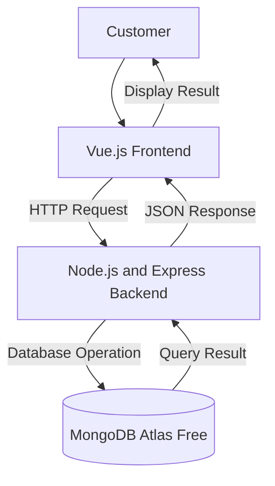

# System Architectural Design
## 1. System Overview
The proposed Food Ordering System is a web-based application that allows customers to browse food menus, place orders, and track their order status online. Restaurant staff can manage menu items, process customer orders, and monitor transactions through an administrative dashboard. The system aims to provide a faster, more convenient, and accurate food ordering experience.
## 2. Selected Architectural Pattern
The proposed system will use a three-tier client-server architecture.
The system will be divided into:
1. Presentation layer
2. Application layer
3. Data layer
This architecture separates the user interface, business logic, and data
management responsibilities.
## 3. Architectural Components
### Presentation Layer
The presentation layer will use Vue.js. It will display food menus, allow customers to register, log in, place orders, and view order status while sending requests to the backend.
### Application Layer
The application layer will use Node.js and Express. It will receive requests, validate customer information and orders, process business logic, calculate order totals, and communicate with the database.
### Data Layer
The data layer will use MongoDB Atlas Free. It will store customer accounts, food menu items, orders, payments, and other system records.
## 4. Component Responsibilities
| Component | Technology | Responsibility |
|---|---|---|
| User Interface | Vue.js | Displays menus, accepts customer input, and shows order status |
| Application Server | Node.js and Express | Processes orders, validates data, and applies business rules |
| Database | MongoDB Atlas Free | Stores customer, menu, and order records |
| Repository | GitHub | Stores documentation and tracks project changes |
## 5. System Architecture Diagram

## 6. Data Flow
### Example Process: Create a New Record
1. The customer selects food items through the Vue.js interface.
2. Vue.js validates the selected items and required information.
3. The frontend sends an HTTP request to the Express backend.
4. The backend validates the order and calculates the total amount.
5. The backend stores the order in MongoDB.
6. MongoDB saves the order information.
7. MongoDB returns the result to the backend.
8. The backend sends a JSON response to the frontend.
9. The frontend displays an order confirmation and status.
## 7. Database Plan
### Proposed Database Name
```text
food_ordering_db
```
### Primary Collection
```text
orders
```
### Proposed Fields
| Field | Type | Description |
|---|---|---|
| _id | ObjectId | Unique record identifier |
| name | String | Name or title of the record |
| description | String | Additional information |
| status | String | Current record status |
| createdAt | Date | Date the record was created |
| updatedAt | Date | Date the record was updated |
## 8. Design Justification
The three-tier architecture is appropriate for the Food Ordering System because it separates the user interface, application logic, and database into independent layers. This separation improves maintainability by allowing developers to modify one layer without significantly affecting the others. It also enhances security by preventing direct access to the database from the frontend, improves testing by allowing each layer to be tested independently, and supports future development by making it easier to add new features such as online payment, delivery tracking, and customer reviews.
## 9. Architectural Limitations
The current activity focuses only on the proposed architecture. Frontend development, backend implementation, database connectivity, authentication, payment integration, and deployment have not yet been completed. These components will be developed in Module 7.
