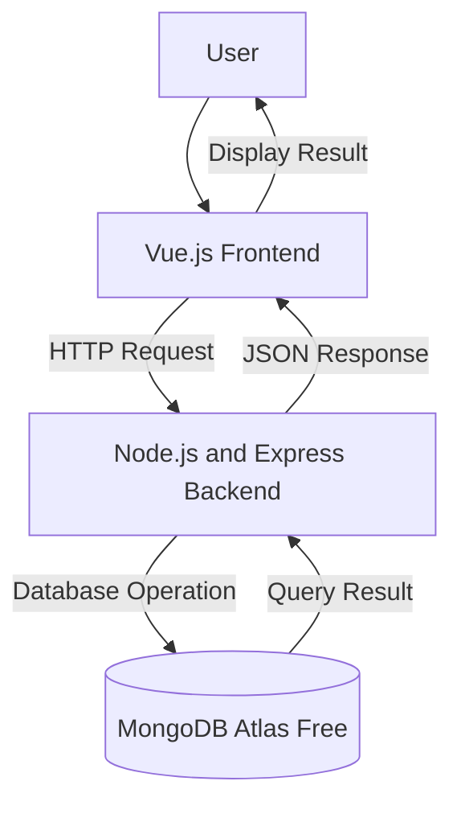

# System Architectural Design
## 1. System Overview
The proposed Food Ordering System is a web-based application that allows customers to browse food menus, place orders, and track their order status online. Restaurant staff can manage menu items, process customer orders, and monitor transactions through an administrative dashboard. The system aims to provide a faster, more convenient, and accurate food ordering experience.
## 2. Selected Architectural Pattern
The proposed system will use a three-tier client-server architecture.
The system will be divided into:
1. Presentation layer
2. Application layer
3. Data layer
This architecture separates the user interface, business logic, and data
management responsibilities.
## 3. Architectural Components
### Presentation Layer
The presentation layer will use Vue.js. It will display food menus, allow customers to register, log in, place orders, and view order status while sending requests to the backend.
### Application Layer
The application layer will use Node.js and Express. It will receive requests, validate customer information and orders, process business logic, calculate order totals, and communicate with the database.
### Data Layer
The data layer will use MongoDB Atlas Free. It will store customer accounts, food menu items, orders, payments, and other system records.
## 4. Component Responsibilities
| Component | Technology | Responsibility |
|---|---|---|
| User interface | Vue.js | Displays data and collects user input |
| Application server | Node.js and Express | Processes requests and applies business rules |
| Database | MongoDB Atlas Free | Stores and manages system records |
| Repository | GitHub | Stores documentation and tracks changes |
## 5. System Architecture Diagram

## 6. Data Flow
### Example Process: Create a New Record
1. The user enters information through the Vue.js interface.
2. Vue.js checks the required input fields.
3. The frontend sends an HTTP request to the Express backend.
4. The backend validates and processes the request.
5. The backend sends a database operation to MongoDB.
6. MongoDB stores the new record.
7. MongoDB returns the result to the backend.
8. The backend sends a JSON response to the frontend.
9. The frontend displays a confirmation message.
## 7. Database Plan
### Proposed Database Name
```text
system_name_db
```
### Primary Collection
```text
records
```
Replace records with the main record of the proposed system.
Examples include books, products, tasks, appointments, events, and assets.
### Proposed Fields
| Field | Type | Description |
|---|---|---|
| _id | ObjectId | Unique record identifier |
| name | String | Name or title of the record |
| description | String | Additional information |
| status | String | Current record status |
| createdAt | Date | Date the record was created |
| updatedAt | Date | Date the record was updated |
Students must replace the sample fields with fields appropriate to their
proposed system.
## 8. Design Justification
Explain why the three-tier architecture is appropriate for the proposed
system. Discuss how separating the frontend, backend, and database can
improve maintainability, security, testing, and future development.
## 9. Architectural Limitations
The current activity focuses only on the proposed architecture. Frontend
code, backend code, database connection, user authentication, and deployment
have not yet been implemented. These components will be developed in Module 7.